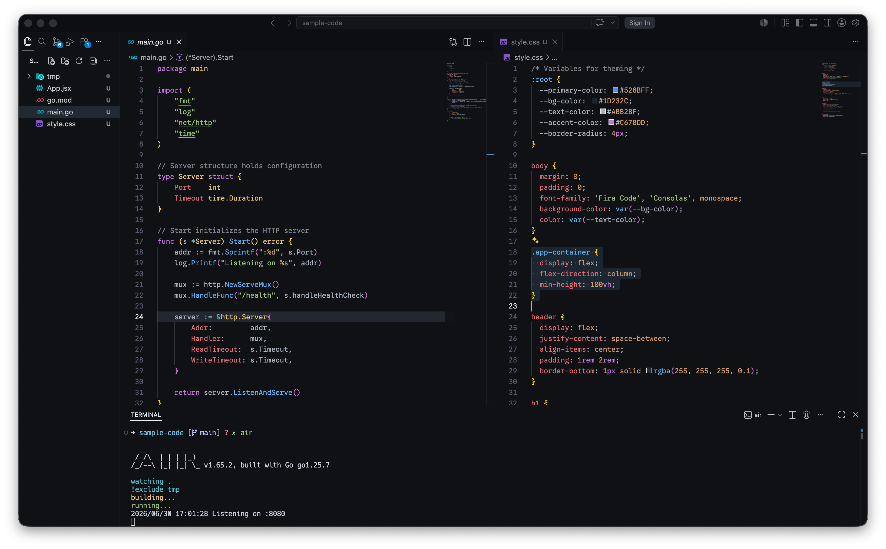
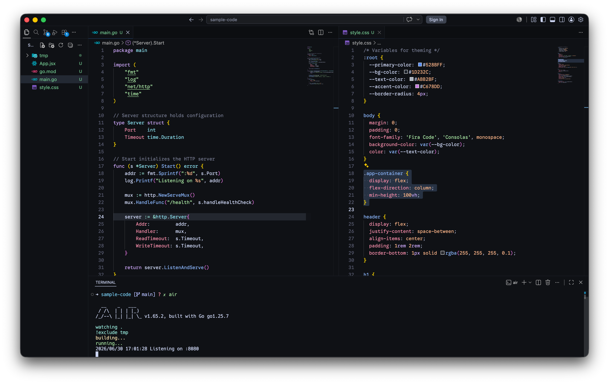
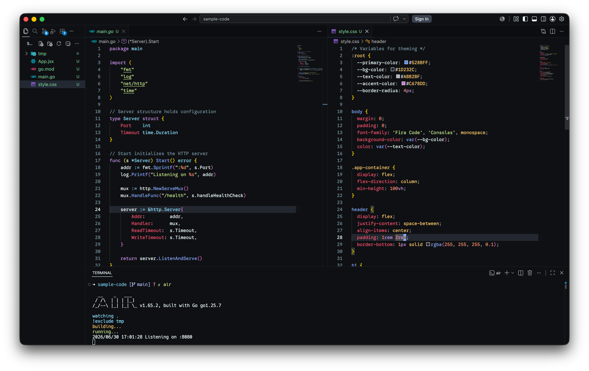
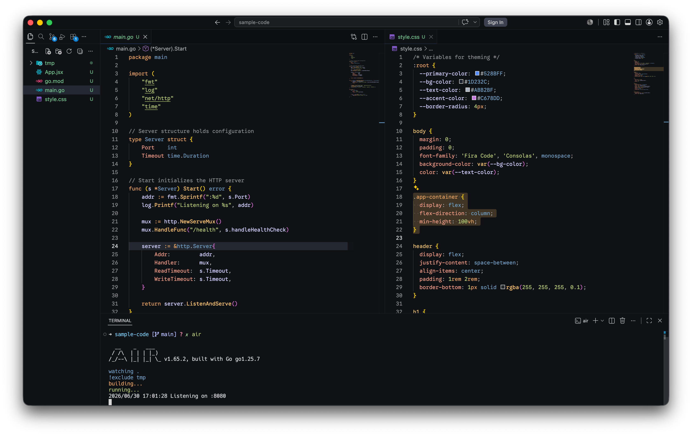
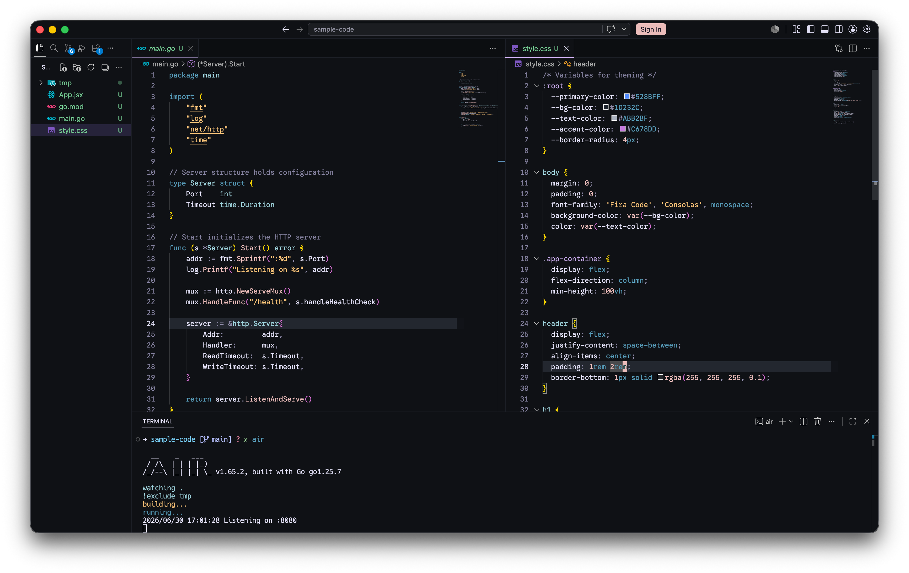
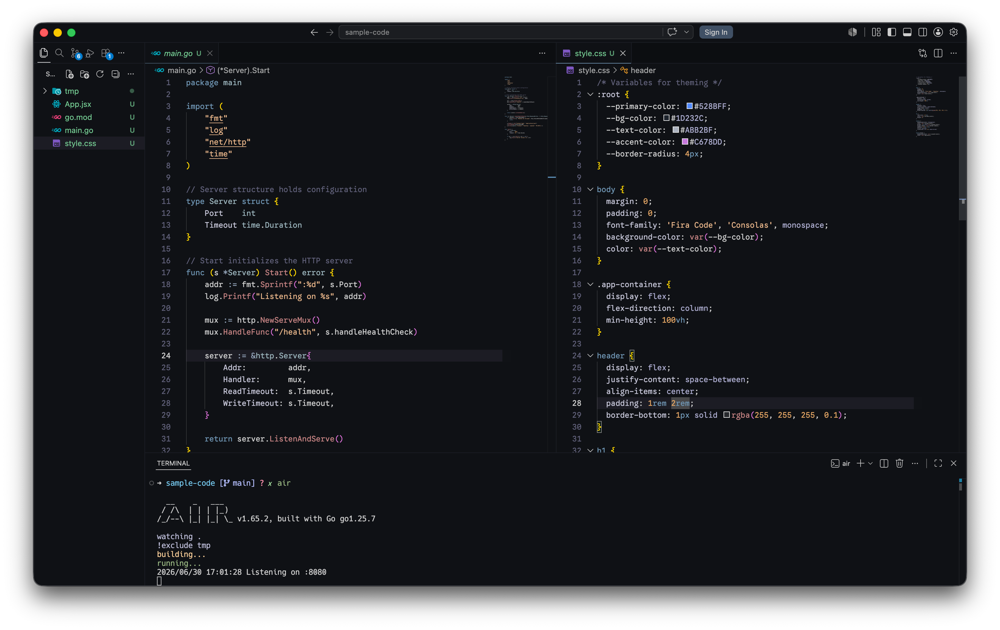

# Atomic Dark for VS Code


Atomic Dark is a sleek, opinionated dark theme crafted specifically for night owls and developers who despise light themes. While there are countless great dark themes available, this collection represents my personal ideal aesthetic taking the syntax colors we already know and love, and refining them with deeper OLED-friendly backgrounds and enhanced contrast.

This extension features 6 distinct variants to suit your coding style:

1. **Atomic Dark** - The classic, rich dark theme (based on One Dark).
2. **Atomic Dark Catppuccin** - The Atomic Dark OLED palette merged with Catppuccin colors.
3. **Atomic Dark Material** - A Material-inspired dark aesthetic.
4. **Atomic Dark Afterglow** - A warm, muted dark theme based on Afterglow.
5. **Atomic Dark Rosé Pine** - A soothing, pastel syntax palette with contrast boosts for OLED displays.
6. **Atomic Dark Vague** - A low-contrast, pastel variant inspired by the `vague.nvim` Neovim colorscheme.

## Previews

<details>
<summary>🌑 Atomic Dark</summary>

</details>
<details>
<summary>🐈 Atomic Dark Catppuccin</summary>

</details>
<details>
<summary>🎨 Atomic Dark Material</summary>

</details>
<details>
<summary>🌅 Atomic Dark Afterglow</summary>

</details>
<details>
<summary>🌹 Atomic Dark Rosé Pine</summary>

</details>
<details>
<summary>🌫️ Atomic Dark Vague</summary>

</details>

## Key Features
- **Unified OLED Backgrounds**: All variants use a deep `#0f1115` background that reduces eye strain and provides striking contrast for syntax colors.
- **Variant-Specific UI Accents**: Floating UI elements (like the Command Palette, menus, and widgets) feature subtle background tints unique to each variant (e.g., dark purple/rose for Rosé Pine, dark teal for Material) to establish a distinct theme identity.
- **Soft Borders**: UI borders have been carefully adjusted to `#1b1e25` to blend seamlessly with the deep backgrounds without being distracting.


## Local Installation / Development

If you want to test or run the theme locally:

1. Clone this repository:
   ```bash
   git clone https://github.com/atomic-dark/vscode.git
   cd vscode
   ```
2. Open the directory in VS Code.
3. Press `F5` (or go to Run and Debug -> click **Launch Extension**) to open a new Extension
   Development Host window.
4. Go to **Color Theme** preferences (`Cmd+K Cmd+T` on Mac, `Ctrl+K Ctrl+T` on Windows/Linux) and
   select one of the **Atomic Dark** variants.

## License

This project is licensed under the [MIT License](LICENSE).
