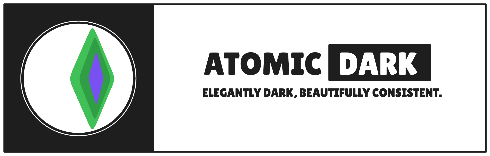

# Atomic Dark for VS Code



Atomic Dark is a sleek, dark theme for Visual Studio Code, ported from the original Atomic Dark
theme built for the Zed editor.

This extension features 4 distinct variants to suit your coding style:

1. **Atomic Dark** - The classic, rich dark theme.
2. **Atomic Dark Catppuccin** - The Atomic Dark palette merged with Catppuccin colors.
3. **Atomic Dark Material** - A Material-inspired dark aesthetic.
4. **Atomic Dark Afterglow** - A warm, muted dark theme based on Afterglow.

### Local Installation / Development

If you want to test or run the theme locally:

1. Clone this repository:
   ```bash
   git clone https://github.com/atomic-dark/vscode.git
   cd vscode
   ```
2. Open the directory in VS Code.
3. Press `F5` (or go to Run and Debug -> click **Launch Extension**) to open a new Extension
   Development Host window.
4. Go to **Color Theme** preferences (`Cmd+K Cmd+T` on Mac, `Ctrl+K Ctrl+T` on Windows/Linux) and
   select one of the **Atomic Dark** variants.

## License

This project is licensed under the [MIT License](LICENSE).
